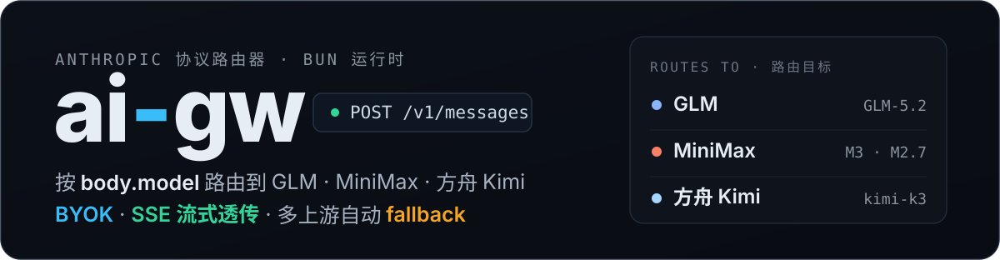
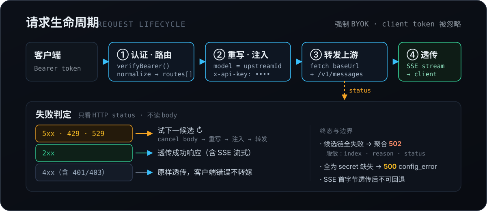
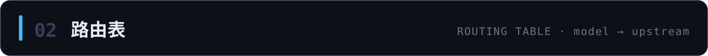
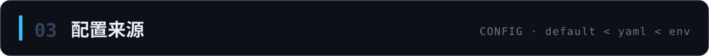
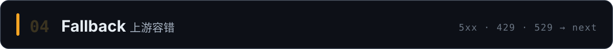

<p align="center">
  
</p>

<p align="center">
  
  
  
  
</p>

**ai-gw** 把 Claude Code / Anthropic SDK 发出的 `/v1/messages` 请求，按 `body.model` 路由到不同国内推理模型上游（**GLM · MiniMax · 方舟 Kimi**）：网关侧统一注入密钥（**BYOK**，忽略客户端带来的 token），SSE 流式原样透传，主上游故障时自动 **fallback** 到备选上游。对客户端而言，只需把 base URL 指向 ai-gw，其余完全透明。

> 1:1 移植自 `cloudflare-ai-gw`（ccc-router Worker），从 Cloudflare Worker 搬到 Bun 独立进程。

## 能做什么

- **model 路由** —— 按 `body.model`（normalize 后）查路由表，命中哪个上游就转发到哪个 `baseUrl/v1/messages`。
- **model 重写** —— 客户端可发别名（如 `glm-5.2[1m]`），转发前重写为上游真实 ID（`GLM-5.2`）；上游不认别名。
- **强制 BYOK** —— 密钥只从服务端 `.env` 注入为 `x-api-key`，**忽略客户端 token**，密钥不落客户端。
- **SSE 流式透传** —— 保留 SSE 友好响应头，thinking + 长输出全程流式，不缓冲。
- **多上游 fallback** —— 主上游 `5xx / 429 / 529` 或网络错时按序尝试备选，命中首个成功响应，对客户端透明。
- **三层配置** —— 内置默认 < YAML 文件 < 环境变量 JSON，逐层覆盖，非法配置启动即 fail-fast。

## 工作原理

<p align="center">
  
</p>

链路：`POST /v1/messages` → `verifyBearer`（Bearer 认证，constant-time 比较）→ `normalizeModel(body.model)` 查表 → 按候选的 `upstreamId` 重写 `body.model` → 注入 `x-api-key` → 转发 `${baseUrl}/v1/messages` → 透传响应（含 SSE）。失败时按候选链 fallback。

<br>


```bash
bun install
cp .env.example .env   # 填入真实 token（CCC_ROUTER_TOKEN 及各上游密钥）
bun run dev            # 监听 127.0.0.1:8787
bun test               # 跑测试（94 个）
```

发一个请求试试（`model` 用路由表里的任意别名）：

```bash
curl http://127.0.0.1:8787/v1/messages \
  -H "Authorization: Bearer $CCC_ROUTER_TOKEN" \
  -H "content-type: application/json" \
  -d '{
    "model": "glm-5.2",
    "max_tokens": 1024,
    "messages": [{ "role": "user", "content": "你好" }]
  }'
```

辅助端点：`GET /`（健康检查，列出 `supported_models`）、`GET /v1/models`（Claude Code 启动校验用）。



内置默认路由表（`src/config.ts`）：

| model（normalize 后） | upstream | baseUrl | upstreamId |
|---|---|---|---|
| `glm-5.2[1m]` / `glm-5.2` | glm | `https://open.bigmodel.cn/api/anthropic` | `GLM-5.2` |
| `minimax-m3[1m]` / `minimax-m3` | minimax | `https://api.minimaxi.com/anthropic` | `MiniMax-M3[1m]` |
| `minimax-m2.7-highspeed` | minimax | `https://api.minimaxi.com/anthropic` | `MiniMax-M2.7-highspeed` |
| `kimi-k3[1m]` / `kimi-k3` | ark | `https://ark.cn-beijing.volces.com/api/plan` | `kimi-k3` |

> **两个关键点：**
> - GLM 上游不认 `[1m]` 后缀，转发前会把 `body.model` 重写为 `upstreamId`。
> - ark（火山方舟）走「Agent Plan」套餐专属端点 `/api/plan`，该 key 在标准端点 `/api/v3/anthropic` 上不被接受（401）。



路由表有三个来源，按优先级合并（后者覆盖前者同名 key）：

| 优先级 | 来源 | 适用场景 |
|---|---|---|
| 低 | `DEFAULT_ROUTES`（`src/config.ts` 硬编码） | 内置兜底，改它需改代码 + 重新部署 |
| 中 | YAML 文件（`CCC_CONFIG_FILE` 指向） | **推荐**：可读、可注释，适合 fallback 链等嵌套结构 |
| 高 | `CCC_ROUTES`（env JSON 数组字符串） | 临时覆盖 / 快速 hotfix，可读性差 |

### YAML 配置（推荐）

复制示例文件并按需修改，再用 `CCC_CONFIG_FILE` 指向它：

```bash
cp ai-gw.example.yaml ai-gw.yaml
CCC_CONFIG_FILE=./ai-gw.yaml bun run dev
```

顶层可选 `upstreams:` 块给每个上游命名（`baseUrl` + `secretKey` + `upstreamId` 三元组定义一次），`routes` 里的 `upstream` 与 `fallbacks` 既能写命名引用，也能内联对象（向后兼容）：

```yaml
upstreams:
  glm:
    baseUrl: https://open.bigmodel.cn/api/anthropic
    secretKey: CCC_GLM_AUTH_TOKEN     # .env 里的变量名，不是真实 token
    upstreamId: GLM-5.2
  ark:
    baseUrl: https://ark.cn-beijing.volces.com/api/plan
    secretKey: CCC_ARK_AUTH_TOKEN
    upstreamId: kimi-k3

routes:
  - aliases: ["kimi-k3", "kimi-k3[1m]"]
    upstream: ark                      # 引用 upstreams.ark
    fallbacks: [glm]                   # 引用 upstreams.glm，三元组不再重复
```

加载时做 schema 校验（`aliases` 非空、`baseUrl` 合法 http(s) URL、`secretKey`/`upstreamId` 非空、`upstreams` 为 mapping），非法配置 **fail-fast** 拒绝启动；引用未定义的上游名也会 fail-fast。`secretKey` 写环境变量名，真实 token 依旧只在 `.env`。



路由表支持「主 + 备」候选链：主上游失败时按序尝试 `fallbacks`，命中首个成功的响应即返回，对客户端透明。可通过 `CCC_CONFIG_FILE`（YAML，见上）或 `CCC_ROUTES`（env JSON）配置；`DEFAULT_ROUTES` 不预置 fallback。下面以 `CCC_ROUTES` 为例：

```json
[
  {
    "aliases": ["kimi-k3", "kimi-k3[1m]"],
    "baseUrl": "https://ark.cn-beijing.volces.com/api/plan",
    "secret": "CCC_ARK_AUTH_TOKEN",
    "upstreamId": "kimi-k3",
    "fallbacks": [
      {
        "baseUrl": "https://open.bigmodel.cn/api/anthropic",
        "secret": "CCC_GLM_AUTH_TOKEN",
        "upstreamId": "GLM-5.2"
      }
    ]
  }
]
```

**失败判定**（只看 HTTP status，不读 body）：

| 上游响应 | 是否 fallback |
|---|---|
| `fetch` 抛错（网络错误） | ✅ |
| 5xx | ✅ |
| 429 / 529（限流 / 过载） | ✅ |
| 4xx（含 401/403，客户端错误） | ❌ 原样透传 |

**终态：**
- 单上游（未配 fallback）：行为不变 —— 5xx/429 原样透传，网络错返回 502，secret 缺失返回 500。
- 多候选：首个 2xx 或 4xx 透传并停止；所有候选都失败时返回**聚合 502**（已脱敏），body 只含每个候选的 `index / reason / status`，**不泄露** `baseUrl`、异常文本或上游正文（完整错误仅供服务端日志）。

**per-candidate model 重写**：每个候选按自己的 `upstreamId` 重写 `body.model`，支持跨 provider 链（如 kimi-k3 主 → GLM 备）。注意 fallback 到不同模型时，输出质量 / 能力可能存在差异。

**已知限制：**
- fallback 仅在「开始向客户端透传上游响应 body 的首字节之前」生效（判定靠 HTTP status）。一旦开始 SSE 流式透传（客户端已收到首字节），上游中断无法回退 —— 这是 SSE 固有限制。
- gw→upstream 的 `fetch` 暂无超时（待 B02）。上游建连成功但 hang 住不返首字节时 `fetch` 不会抛错，fallback 不会触发。


见 `docs/superpowers/plans/2026-07-16-ai-gw-bun.md` Task 7。

- **bun 进程**：`deploy/ai-gw.service`（systemd 管理，`Restart=always`）
- **反代 + TLS**：`caddy/Caddyfile`（Caddy 自动签 LE 证书，`flush_interval -1` 对 SSE 友好）
- **域名**：`aigw.kvmaker.cn` → 1.12.240.16（灰云直连）

## 环境变量

| 变量 | 说明 |
|---|---|
| `CCC_ROUTER_TOKEN` | gateway 自身 Bearer token（客户端认证用） |
| `CCC_GLM_AUTH_TOKEN` / `CCC_MINIMAX_AUTH_TOKEN` / `CCC_ARK_AUTH_TOKEN` | 各上游密钥（BYOK，注入为 `x-api-key`） |
| `CCC_CONFIG_FILE` | 可选，YAML 路由配置文件路径 |
| `CCC_ROUTES` | 可选，JSON 数组，合并覆盖路由表（最高优先级） |
| `PORT` / `HOST` | 监听地址，默认 `8787` / `127.0.0.1` |
