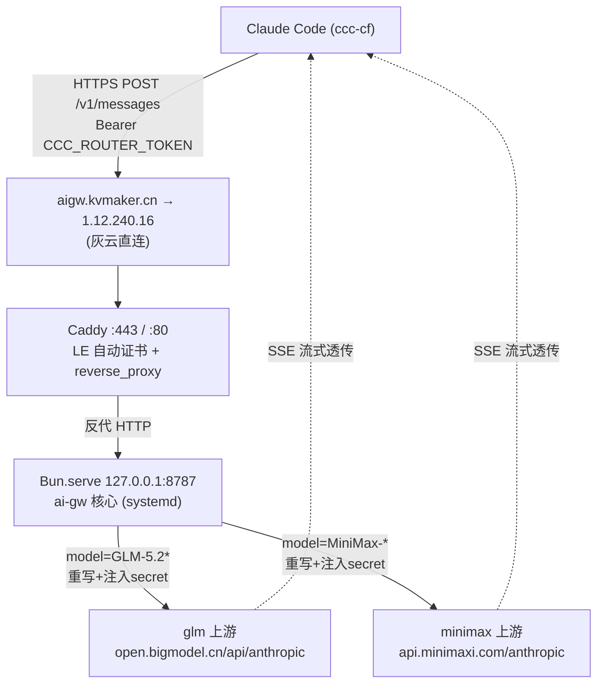
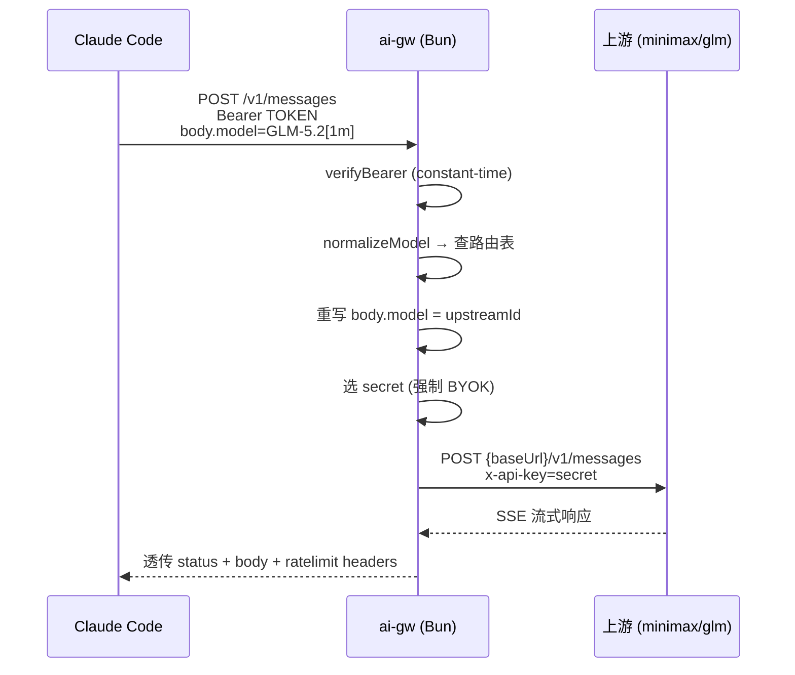

# ai-gw（Bun 版）设计文档

**日期**：2026-07-16
**状态**：已批准，待实施
**来源**：1:1 移植 `cloudflare-ai-gw`（ccc-router Cloudflare Worker）

## 1. 背景与目标

现有 `cloudflare-ai-gw`（代号 ccc-router）是一个部署在 Cloudflare Workers 上的 Anthropic 协议路由器：接收 Claude Code 的 `/v1/messages` 请求，按 `body.model` 路由到 minimax / glm 上游，并把 SSE 流式响应透传回客户端。

本项目的目标是：**用 Bun 运行时重写一个功能完全相同的 ai-gw**，部署在自管服务器 `gz-a100` 上，对外提供 `https://aigw.kvmaker.cn`。脱离 Cloudflare Workers 平台依赖（wrangler、Workers KV 等），换为可控的 Bun + systemd + Caddy 方案。

## 2. 范围

**包含（1:1 移植 Worker 现有功能）：**

- `/v1/messages`（POST）：Bearer 认证 → model 路由 → 重写 model → 注入 secret → 转发上游 → SSE 透传
- `/v1/models`（GET）：列出可用模型（Claude Code 启动校验用）
- `/`（GET）：健康检查
- `OPTIONS`：CORS 预检
- 强制 BYOK（忽略 client token，用注入 secret）
- `normalizeModel`（小写 + 去 `[1m]` 后缀）路由匹配
- **重写 `body.model = upstreamId`**（核心修复点）

**不包含（YAGNI，留给后续）：**

- TODO 中的 R00（多模型 fallback + circuit breaker）
- R04（rate limiting / abuse 防护）
- R05（测试覆盖补全）
- ccc-cf 启动器、statusline 的同步改造（后续单独适配）

## 3. 架构



**请求处理流程（复刻 Worker `handleMessages`）：**



## 4. 代码组织

采用**轻度模块化**（4 个聚焦文件 + 配置），每个文件职责单一、可独立测试：

```
ai-gw/
├── src/
│   ├── index.ts        # 入口：Bun.serve，URL 路由分发，CORS 预检
│   ├── config.ts       # 读 process.env + 路由表（内置默认 + CCC_ROUTES 覆盖）+ normalizeModel
│   ├── auth.ts         # verifyBearer + timingSafeEqual + unauthorized
│   └── handlers.ts     # handleMessages / listModels / health / notFound / badRequest
├── package.json
├── .env.example        # 配置模板（不含真实值）
├── .env                # 真实 secrets（gitignore，部署时填充）
├── .gitignore
├── caddy/
│   └── Caddyfile       # aigw.kvmaker.cn 反代 + 自动 HTTPS
└── deploy/
    └── ai-gw.service   # systemd unit
```

## 5. 配置与 secrets

路由表 **1:1 对应 Worker 的 `ROUTE_TABLE`**，内置为代码默认值（零配置即可运行）；同时支持环境变量 `CCC_ROUTES`（JSON 数组）覆盖，便于不改代码调整路由。

**路由表（内置默认）：**

| normalize 后的 key | baseUrl | secretKey | upstreamId |
|---|---|---|---|
| `minimax-m3[1m]` | `https://api.minimaxi.com/anthropic` | `CCC_MINIMAX_AUTH_TOKEN` | `MiniMax-M3[1m]` |
| `minimax-m3` | 同上 | `CCC_MINIMAX_AUTH_TOKEN` | `MiniMax-M3[1m]` |
| `minimax-m2.7-highspeed` | 同上 | `CCC_MINIMAX_AUTH_TOKEN` | `MiniMax-M2.7-highspeed` |
| `glm-5.2[1m]` | `https://open.bigmodel.cn/api/anthropic` | `CCC_GLM_AUTH_TOKEN` | `GLM-5.2` |
| `glm-5.2` | 同上 | `CCC_GLM_AUTH_TOKEN` | `GLM-5.2` |

> **关键**：`upstreamId` ≠ client 发的 `model`。GLM 上游不认 `[1m]` 后缀，必须把 `body.model` 重写为 `GLM-5.2`；minimax 上游认 `MiniMax-M3[1m]` 别名，保留后缀。

**`.env` 结构：**

```bash
# Gateway 自身
CCC_ROUTER_TOKEN=xxx          # Bearer 认证（client 端持同一值）
PORT=8787                     # Bun 监听端口
HOST=127.0.0.1                # 仅本地，由 Caddy 反代

# 上游 secrets（强制 BYOK，忽略 client token）
CCC_MINIMAX_AUTH_TOKEN=xxx
CCC_GLM_AUTH_TOKEN=xxx

# 可选：覆盖内置路由表（JSON 数组）
# CCC_ROUTES='[{"aliases":["glm-5.2"],"baseUrl":"...","secret":"CCC_GLM_AUTH_TOKEN","upstreamId":"GLM-5.2"}]'
```

**secrets 来源**：从 `cloudflare-ai-gw/worker/.dev.vars` 读取（与原 Worker 三处同值），部署时 scp 到 gz-a100 的 `.env`。全程不打印到日志/对话。

## 6. 核心逻辑移植映射

Bun 原生支持 Web 标准 API（`Request`/`Response`/`Headers`/`fetch`/`ReadableStream`），Worker 逻辑可近乎原样搬移：

| Worker（index.ts） | Bun 版 | 改动程度 |
|---|---|---|
| `export default { fetch(req, env) }` | `Bun.serve({ port, async fetch(req) })` | 入口改写；`env` → `process.env` |
| `Request/Response/Headers` | 同（Bun 原生） | 不改 |
| `fetch(upstreamUrl, …)` | 同 | 不改 |
| `new Response(upstreamResp.body, …)` SSE 透传 | 同 | 不改，body 即 ReadableStream |
| `timingSafeEqual` / `verifyBearer` | 同 | 直接搬 |
| `normalizeModel` / 路由表 | 同 | 直接搬 |
| 重写 `body.model = upstreamId` | 同 | 直接搬（核心修复点） |

**端点行为（与 Worker 完全一致）：**

| 端点 | 方法 | 行为 |
|---|---|---|
| `/v1/messages` | POST | Bearer 校验 → 路由 → 重写 model → 注入 secret → 转发 → SSE 透传 |
| `/v1/models` | GET | Bearer 校验 → 返回 upstreamId 去重列表 |
| `/` | GET | 健康检查（返回 supported_models） |
| `OPTIONS` | - | 204 + CORS 头 |
| 其他 | - | 404 |

**上游请求头**：`Content-Type: application/json`、`x-api-key: <secret>`、`anthropic-version`（透传 client 或默认 `2023-06-01`）、`anthropic-beta`（透传）。

**透传的响应头**：`content-type`、`Cache-Control: no-cache`、`request-id`、`anthropic-organization-id`、`anthropic-ratelimit-requests-remaining/reset`、`anthropic-ratelimit-tokens-remaining/reset`、`retry-after`、CORS。

**错误码**：

| 状态 | 触发 |
|---|---|
| 400 | body 非 JSON / 缺 `model` / 不支持的 model |
| 401 | Bearer 缺失或不匹配 |
| 404 | 路径不存在 |
| 405 | 方法不允许 |
| 500 | token 未配置（config_error） |
| 502 | fetch 上游失败（upstream_error） |

## 7. 部署方案（gz-a100）

**环境前提**（已探测确认）：

- gz-a100：Ubuntu 5.15，16 核 / 93G 内存，80/443/8787 端口公网可达（EIP 1.12.240.16 全端口映射）
- systemd 249 可用
- bun / caddy 未安装（需安装）；nginx 已装但未占用端口（不使用，用 Caddy）

**部署步骤：**

1. **装 bun**：`curl -fsSL https://bun.sh/install | bash`（装到 `~/.bun`）
2. **部署代码**：`git clone` 或 rsync 到 `~/ai-gw`，`bun install`（基本零依赖）
3. **配置 secrets**：`.env` 放入 3 个 `CCC_*` token + PORT/HOST
4. **systemd 服务**：`deploy/ai-gw.service` → `ExecStart=%h/.bun/bin/bun run src/index.ts`，`Restart=always`，`EnvironmentFile=%h/ai-gw/.env`
5. **装 Caddy**（官方 apt 源），配置 `caddy/Caddyfile`：
   ```caddyfile
   aigw.kvmaker.cn {
       reverse_proxy 127.0.0.1:8787
   }
   ```
   Caddy 自动用 HTTP-01 签发并续期 Let's Encrypt 证书
6. **DNS**：用户在 Cloudflare 后台加 `aigw.kvmaker.cn` A 记录 → `1.12.240.16`，**灰云（DNS only）**

## 8. 测试与验收

**本地验证：**

- `bun run src/index.ts`，curl 验证：
  - `GET /` → 健康检查 + supported_models
  - `GET /v1/models`（带 Bearer）→ 模型列表
  - `POST /v1/messages`（带 Bearer + 合法 model）→ 上游正常响应 + SSE 流式

**线上验证：**

- `curl https://aigw.kvmaker.cn/` → 健康检查通
- 证书有效（LE 签发）

**端到端验收（复刻 Worker 4 条用例）：**

1. minimax 路由：model `MiniMax-M3[1m]` 正常对话 ✅
2. minimax 路由：model `MiniMax-M2.7-highspeed` 正常对话 ✅
3. glm 路由：model `GLM-5.2[1m]`（重写为 `GLM-5.2`）正常对话 ✅
4. 同一 `ANTHROPIC_BASE_URL`，不同 model 路由到不同上游 ✅
5. ccc-cf 临时指向新 gateway，跑一轮 Claude Code 多角色会话（opus/reasoning=GLM, sonnet/subagent=minimax）✅

## 9. 待确认前提与风险

| 项 | 说明 | 缓解 |
|---|---|---|
| **DNS 记录** | 用户需在 CF 后台加 `aigw.kvmaker.cn → 1.12.240.16`（灰云） | LE 签证书与对外访问的前置条件，部署前完成 |
| **磁盘紧张** | gz-a100 已用 95%（剩 56G） | 装 bun（~50MB）无碍；提醒用户清理 |
| **灰云 vs 橙云** | 默认灰云最简；若需 CF 代理隐藏 IP，Caddy 要改用 DNS-01（caddy-cloudflare 插件 + CF API token） | 默认灰云，按需再切换 |
| **secrets 同步** | 需从 `worker/.dev.vars` 取 3 个 token 写入 gz-a100 `.env` | 实施时用 scp 直接传文件，不打印值 |
| **ccc-cf 适配** | 本期不做，但端到端测试需临时改 `ANTHROPIC_BASE_URL` | 测试时手动指定，正式适配留后续 |

## 10. 参考

- 原项目：`cloudflare-ai-gw/worker/src/index.ts`（290 行，唯一源文件）
- 原设计：`cloudflare-ai-gw/docs/superpowers/specs/2026-07-15-ccc-router-worker-design.md`
- 项目说明：`cloudflare-ai-gw/CLAUDE.md`
