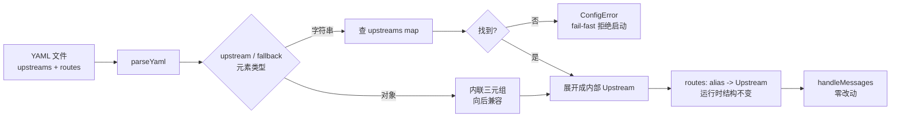

# YAML 命名上游（简化 fallback 配置）— 设计

- 日期：2026-07-18
- 模块：`src/config.ts`（YAML 加载层）
- 状态：设计已与用户确认，待实现

## 背景与痛点

当前 YAML 路由配置（`ai-gw.example.yaml`）里，每个 fallback 候选都要**完整重写** `baseUrl` + `secretKey` + `upstreamId` 三行。以 example 的 3 条路由为例，GLM-5.2 这套三元组被重复写了 **3 次**：

1. 作为 `glm-5.2` 路由的主上游；
2. 作为 `kimi-k3` 的 fallback；
3. 作为 `minimax-m3` 的 fallback。

改一个 `baseUrl` / token 变量名要改三处，易错、难维护。

## 目标

引入「命名上游」机制：每个上游（三元组）在顶层 `upstreams:` 块里**定义一次**并命名，路由的 `upstream` / `fallbacks` 只需引用名字。消除 fallback 配置里的三元组重复。

## 非目标

- **不改 env JSON 层**（`CCC_ROUTES` / `loadRoutesFromEnv`）：它是临时覆盖、单条简单路由为主，保持现状。
- **不改 `DEFAULT_ROUTES`**：内置兜底表保持不变。
- **不改运行时**（`handlers.ts`）：候选链、SSE 透传、fallback 判定全部不动。
- **不引入 provider/model 两层分离**：当前每个 provider 单一 model 已满足，YAGNI。

## 设计

### 核心思想

简化是**纯 YAML 解析层**的事：解析时把「名字引用」展开成完整三元组，产出与今天完全相同的内部 `Upstream` 结构。运行时零改动。



### YAML schema 扩展

顶层新增**可选**的 `upstreams:` map：键 = 上游名，值 = 完整三元组（`baseUrl` + `secretKey` + `upstreamId`）。

route 的 `upstream` 字段与 `fallbacks[]` 数组元素，**既可以是字符串（引用 `upstreams` 里的名字），也可以是对象（内联三元组，向后兼容旧格式）**，允许在同一文件内混用。

```yaml
upstreams:
  glm:
    baseUrl: https://open.bigmodel.cn/api/anthropic
    secretKey: CCC_GLM_AUTH_TOKEN
    upstreamId: GLM-5.2
  ark:
    baseUrl: https://ark.cn-beijing.volces.com/api/plan
    secretKey: CCC_ARK_AUTH_TOKEN
    upstreamId: kimi-k3
  minimax:
    baseUrl: https://api.minimaxi.com/anthropic
    secretKey: CCC_MINIMAX_AUTH_TOKEN
    upstreamId: MiniMax-M3[1m]

routes:
  - aliases: ["glm-5.2", "glm-5.2[1m]"]
    upstream: glm                      # 字符串引用
  - aliases: ["kimi-k3", "kimi-k3[1m]"]
    upstream: ark
    fallbacks: [glm]                   # 字符串引用
  - aliases: ["minimax-m3", "minimax-m3[1m]"]
    upstream: minimax
    fallbacks:
      - glm                            # 引用
      - { baseUrl: https://x/, secretKey: CCC_X, upstreamId: foo }  # 内联（混用允许）
```

### 解析与校验（改造 `loadRoutesFromYaml`）

1. **解析顶层 `upstreams:`（可选）**：收集成 `Map<name, YamlUpstreamRaw>`，对每个值复用现有 `validateUpstream` 校验。
2. **`upstreams` 名字重复 → `ConfigError`**（例：`upstreams.glm: duplicate definition`）。
3. **解析每条 route 的 `upstream` 与每个 fallback 元素**，类型分派：
   - **字符串** → 在 `upstreams` map 查；
     - 查不到 → `ConfigError`（例：`routes[1].fallbacks[0]: unknown upstream reference "glm"`），fail-fast 拒绝启动。
     - 查到 → 用其三元组。
   - **对象** → 内联三元组，复用 `validateUpstream`（旧格式无缝工作）。
   - **既非字符串也非对象** → `ConfigError`（类型错误）。
4. **`upstreams:` 缺省时**：行为与今天完全一致（route 必须用内联对象）。
5. 顶层三形态保持兼容：直接数组、`{ routes: [...] }`、`{ upstreams: ..., routes: [...] }` 均合法。
6. 展开后产出内部 `Upstream`（`baseUrl` + `secretKey` + `upstreamId` + 可选 `fallbacks`）。

### 运行时结构不变

`handlers.ts` 完全不动：解析阶段已把引用展开成内联三元组，运行时拿到的 `Upstream` 与今天逐字节相同。`loadConfig` 里 `secretKey` 的动态收集（扫主上游 + fallback 候选）逻辑也不变——引用展开后所有 `secretKey` 自然出现在合并后的路由表里。

### 范围与兼容性

| 层 | 是否改动 |
|---|---|
| YAML 层（`loadRoutesFromYaml` + 校验） | ✅ 改造（核心） |
| `handlers.ts` 运行时 | ❌ 完全不动 |
| env JSON（`CCC_ROUTES` / `loadRoutesFromEnv`） | ❌ 不动 |
| `DEFAULT_ROUTES` 内置兜底 | ❌ 不动 |
| 旧的内联 YAML（无 `upstreams:` 块） | ✅ 向后兼容 |

## 测试计划（`test/config.test.ts` 新增）

- **命名上游 + 字符串引用**：主上游与 fallback 均用名字引用，断言展开后的 `Upstream` 三元组正确。
- **引用不存在的名字 → `ConfigError`**：覆盖 `upstream` 与 `fallbacks` 两个位置。
- **`upstreams` 名字重复 → `ConfigError`**。
- **向后兼容**：纯内联（无 `upstreams:` 块）仍正常解析（现有用例作回归网，不改动）。
- **混用**：同一文件里引用与内联对象混用（如 minimax 那条），断言两者都正确展开。
- **顶层三形态**：数组 / `{routes:[]}` / `{upstreams:..., routes:[]}` 均支持。
- **`upstreams:` 缺省**：等价于今天的行为。

## 文档更新

- 重写 `ai-gw.example.yaml` 用新格式（命名上游），保留对旧内联格式的说明注释。
- `README.md`：YAML 配置小节补充 `upstreams:` 用法。
- `CLAUDE.md`：Gotcha 第 7 条（YAML 配置层）补充命名上游机制与 fail-fast 行为。

## 风险与取舍

- **引用展开是「复制」而非「共享引用」**：同一名字被多处引用时，展开成独立的 `Upstream` 对象。运行时本就按候选链独立处理，无副作用。
- **`upstreams` 名字空间是平的**：不区分主上游与 fallback 候选，名字全局唯一。简单够用；若未来需要分层再扩展。
- **未引入 provider/model 分离**：同一 provider 多个 model（如 minimax 的 M3 与 M2.7-highspeed）仍需定义两个命名上游，`baseUrl`/`secretKey` 会重复一次。当前 example 无此场景，YAGNI；若日后成为痛点，可平滑升级到两层结构（命名上游层保持兼容）。

## 验收标准

- `ai-gw.example.yaml` 改写后，GLM 三元组只出现一次。
- `bun test` 全绿（含新增用例），现有 81 个用例不回归。
- 旧的内联 YAML（若用户未迁移）仍能启动。
- 引用错误时进程 fail-fast 拒绝启动，错误信息指明位置与引用名。
